# Pre-entrega 4 --- Procesamiento Stateful en AWS con Amazon Managed Service for Apache Flink

## Objetivo

Extender la plataforma de streaming incorporando procesamiento **stateful** en AWS mediante:

- **Amazon Kinesis Data Streams** como bus de eventos.
- **Amazon Data Firehose** para persistencia de eventos raw en Amazon S3.
- **Amazon Managed Service for Apache Flink** para procesamiento streaming.
- **PyFlink / Table API** para Event Time, watermarks, ventanas y agregaciones.
- **Amazon CloudWatch** para métricas, logs y checkpoints.
- **Terraform** para administrar la infraestructura como código.
- **Python** para simular sensores urbanos y publicar eventos.

El flujo implementado es:

```text
kinesis_sensor_producer.py
          ↓
      eventos JSON
          ↓
 Amazon Kinesis Data Streams
      urban-sensors-dev
          │
          ├──────────────► Amazon Data Firehose
          │                       ↓
          │                  Amazon S3 raw
          │                  ingesta/*.gz
          │
          └──────────────► Amazon Managed Flink
                                  ↓
                              PyFlink
                                  ↓
                           Event Time
                                  ↓
                         Watermark de 5 s
                                  ↓
                       Tumbling Window 1 min
                                  ↓
                      GROUP BY sensor_id
                         ├── AVG temperature
                         ├── AVG air_quality_index
                         └── COUNT
                                  ↓
                    Checkpointing cada 60 s
                                  ↓
                         Amazon CloudWatch
```

---

# 1. Estructura del proyecto

La Pre-entrega 4 reutiliza la infraestructura modular de Terraform ubicada en `pre entrega2` y agrega los artefactos específicos de Flink en `pre entrega4`.

```text
CD_DE/
│
├── pre entrega2/
│   ├── enviroments/
│   │   └── dev/
│   │       └── main.tf
│   └── modules/
│       ├── kinesis/
│       │   ├── main.tf
│       │   ├── variables.tf
│       │   └── outputs.tf
│       └── flink/
│           ├── iam.tf
│           ├── main.tf
│           ├── outputs.tf
│           └── variables.tf
│
└── pre entrega4/
    ├── README.md
    ├── flink/
    │   ├── urban_flink.py
    │   ├── pom.xml
    │   ├── urban_flink.zip
    │   └── lib/
    │       └── pyflink-dependencies.jar
    ├── scripts/
    │   └── kinesis_sensor_producer.py
    ├── imagenes/
    │   ├── 01-terraform-validate.png
    │   ├── 02-terraform-apply-base.png
    │   ├── 03-kinesis-active.png
    │   ├── 04-firehose-active.png
    │   ├── 05-s3-flink-artifact.png
    │   ├── 06-terraform-apply-flink.png
    │   ├── 07-flink-ready.png
    │   ├── 08-flink-running.png
    │   ├── 09-producer-kinesis.png
    │   ├── 10-flink-cloudwatch-metrics.png
    │   ├── 11-flink-checkpoints-cloudwatch.png
    │   ├── 12-flink-job-graph.png
    │   ├── 13-firehose-s3-raw.png
    │   ├── 14-terraform-state.png
    │   ├── 15-terraform-no-changes.png
    │   └── 16-terraform-destroy.png
    └── evidencias/
        ├── 03-maven-build.txt
        ├── 04-flink-jar.txt
        ├── 08-flink-describe-ready.txt
        ├── 09-terraform-state.txt
        ├── 10-terraform-plan-final.txt
        └── 11-terraform-destroy.txt
```

> Nota: la carpeta se denomina `enviroments` en la estructura actual del repositorio y se conserva ese nombre para mantener compatibilidad con las rutas existentes.

---

# 2. Requisitos previos

Entorno utilizado:

- Windows.
- PowerShell.
- AWS CLI configurado y autenticado.
- Terraform.
- Python y `boto3`.
- OpenJDK 17.
- Apache Maven 3.9.x.
- VS Code.
- Acceso a AWS en `us-east-1`.

Verificar:

```powershell
aws sts get-caller-identity
terraform version
python --version
java -version
mvn -version
```

---

# 3. Infraestructura administrada con Terraform

El módulo raíz se encuentra en:

```text
pre entrega2/enviroments/dev
```

Desde allí se integran S3, Kinesis Data Streams, Data Firehose, IAM, CloudWatch Logs y Managed Service for Apache Flink.

Recursos principales utilizados:

```text
Kinesis stream: urban-sensors-dev
Modo: PROVISIONED
Shards: 2

S3 bucket: coderhouse-urban-streaming-raw-gusper-dev

Managed Flink application: urban-stream-processing-dev
Runtime: FLINK-1_19
```

---

# 4. Validación previa de Terraform

Para formatear todos los archivos Terraform:

```powershell
cd "C:\Users\Lenovo\Documents\GitHub\CD_DE\pre entrega2"
terraform fmt -recursive
```

Luego:

```powershell
cd ".\enviroments\dev"
terraform validate
terraform plan
```

Resultado de validación:

```text
Success! The configuration is valid.
```

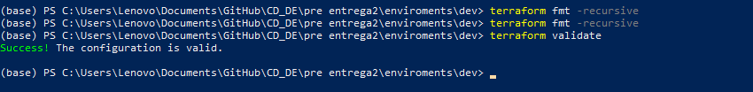

El plan completo inicial mostró:

```text
Plan: 12 to add, 0 to change, 0 to destroy.
```

---

# 5. Construcción de dependencias PyFlink

Desde:

```powershell
cd "C:\Users\Lenovo\Documents\GitHub\CD_DE\pre entrega4\flink"
```

ejecutar:

```powershell
mvn package
```

El archivo `pom.xml` construye el JAR de dependencias necesario para el conector Kinesis.

Resultado:

```text
target/pyflink-dependencies.jar
BUILD SUCCESS
```

El JAR se copia a:

```text
lib/pyflink-dependencies.jar
```

El archivo generado tuvo un tamaño aproximado de 66 MB.

---

# 6. Empaquetado de la aplicación

El ZIP utilizado por Managed Flink tiene esta estructura:

```text
urban_flink.zip
├── urban_flink.py
└── lib/
    └── pyflink-dependencies.jar
```

No debe existir una carpeta `flink/` adicional dentro de la raíz del ZIP porque Managed Flink utiliza:

```text
python  = urban_flink.py
jarfile = lib/pyflink-dependencies.jar
```

El artefacto local queda en:

```text
pre entrega4/flink/urban_flink.zip
```

---

# 7. Aplicación PyFlink

`urban_flink.py` utiliza PyFlink Table API y obtiene las propiedades de ejecución proporcionadas por Managed Flink desde:

```text
/etc/flink/application_properties.json
```

Se utiliza el grupo:

```text
consumer.config.0
```

con:

```text
stream.name
aws.region
flink.stream.initpos
```

---

# 8. Event Time y Watermarks

Los eventos generados tienen esta estructura:

```json
{
  "sensor_id": "sensor_zona_3",
  "temperature": 27.42,
  "humidity": 63.15,
  "air_quality_index": 87,
  "event_time": "2026-08-29 18:14:23"
}
```

`event_time` se utiliza como **Event Time**.

La tabla PyFlink define:

```sql
event_time TIMESTAMP(3),
WATERMARK FOR event_time
    AS event_time - INTERVAL '5' SECOND
```

El watermark admite un retraso de 5 segundos.

El Job Graph real mostró el operador:

```text
WatermarkAssigner
```

---

# 9. Procesamiento stateful y ventanas

Se utiliza una **Tumbling Window de 1 minuto**:

```sql
TUMBLE(
    TABLE urban_sensors,
    DESCRIPTOR(event_time),
    INTERVAL '1' MINUTE
)
```

Los eventos se agrupan por:

```text
sensor_id
window_start
window_end
```

y se calculan:

```text
AVG(temperature)
AVG(air_quality_index)
COUNT(*)
```

El Job Graph mostró:

```text
LocalWindowAggregate
GlobalWindowAggregate
```

y redistribución `HASH`, evidenciando el procesamiento stateful por ventanas.

---

# 10. Checkpointing y tolerancia a fallos

Configuración:

```text
Checkpointing enabled: true
Checkpoint interval: 60000 ms
Minimum pause: 5000 ms
```

Es decir, un checkpoint cada 60 segundos.

CloudWatch mostró checkpoints consecutivos completados correctamente, entre ellos los checkpoints 40 a 55.

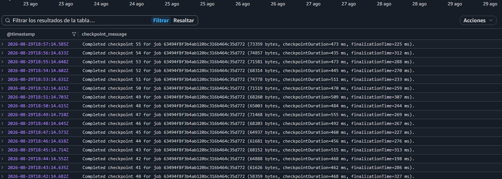

---

# 11. Monitoreo y CloudWatch

Terraform creó el grupo y stream de logs de Flink:

```text
/aws/kinesis-analytics/urban-stream-processing-dev
└── kinesis-analytics-log-stream
```

La aplicación utiliza `cloudwatch_logging_options` para asociar el stream.

Configuración:

```text
log_level     = INFO
metrics_level = APPLICATION
```

Durante la ejecución se observaron métricas como:

```text
uptime
lastCheckpointSize
millisBehindLatest
bytesRequestedPerFetch
```

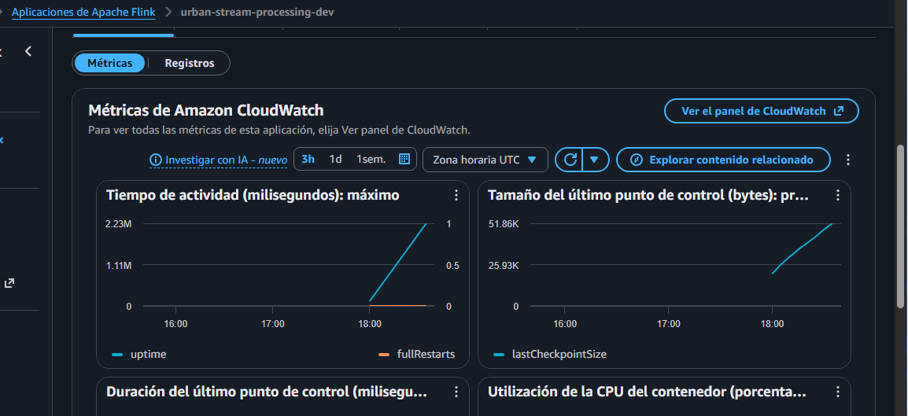

---

# 12. Orden de despliegue

El despliegue se realiza en dos etapas porque el artefacto PyFlink se carga manualmente en S3.

## Etapa 1 --- Inicializar y validar

Desde el módulo raíz:

```powershell
cd "C:\Users\Lenovo\Documents\GitHub\CD_DE\pre entrega2\enviroments\dev"

terraform init
terraform validate
terraform plan
```

El `terraform fmt -recursive` se ejecuta previamente desde `pre entrega2`.

## Etapa 2 --- Crear infraestructura base

```powershell
terraform apply -target="aws_s3_bucket.data_lake_rw" -target="module.kinesis"
```

Resultado:

```text
Plan: 7 to add, 0 to change, 0 to destroy.
```

Este primer `apply` crea:

- Bucket S3.
- Kinesis Data Stream.
- Amazon Data Firehose.
- IAM de Firehose.
- CloudWatch de Firehose.

El uso de `-target` es intencional y se limita al bootstrap: el bucket debe existir antes de cargar manualmente el ZIP.

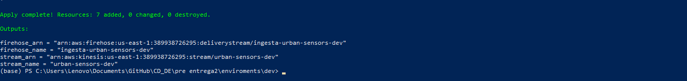

## Etapa 3 --- Verificar infraestructura base

Kinesis:

```powershell
aws kinesis describe-stream-summary `
  --stream-name urban-sensors-dev `
  --region us-east-1
```

Se verificó:

```text
StreamStatus: ACTIVE
StreamMode: PROVISIONED
OpenShardCount: 2
```

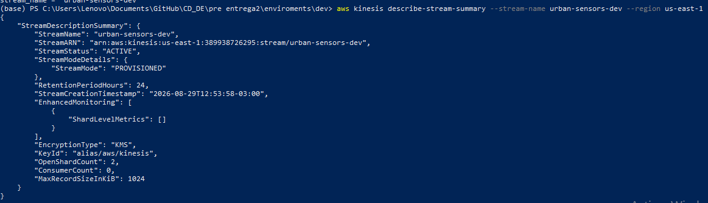

Firehose:

```powershell
aws firehose describe-delivery-stream `
  --delivery-stream-name ingesta-urban-sensors-dev `
  --region us-east-1
```

Se verificó el estado `ACTIVE`, Kinesis como source y S3 como destino.

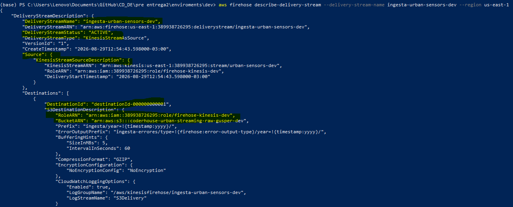

## Etapa 4 --- Carga manual del paquete ZIP(Python + JAR) en S3

```powershell
aws s3 cp `
"C:\Users\Lenovo\Documents\GitHub\CD_DE\pre entrega4\flink\urban_flink.zip" `
"s3://coderhouse-urban-streaming-raw-gusper-dev/flink/urban_flink.zip"
```

Verificar:

```powershell
aws s3 ls s3://coderhouse-urban-streaming-raw-gusper-dev/flink/
```

Debe aparecer:

```text
urban_flink.zip
```

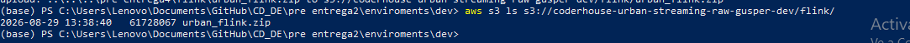

## Etapa 5 --- Desplegar Managed Flink

Con el ZIP disponible:

```powershell
terraform plan
terraform apply
```

El segundo plan mostró:

```text
Plan: 5 to add, 0 to change, 0 to destroy.
```

Se crean:

```text
IAM Role de Flink
IAM Policy de Flink
CloudWatch Log Group
CloudWatch Log Stream
Managed Flink Application
```

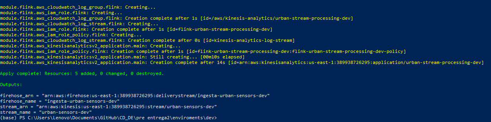

---

# 13. Verificar Managed Flink

Consultar:

```powershell
aws kinesisanalyticsv2 describe-application `
  --application-name urban-stream-processing-dev `
  --region us-east-1 `
  --query "ApplicationDetail.{Name:ApplicationName,Status:ApplicationStatus,Runtime:RuntimeEnvironment,Version:ApplicationVersionId}"
```

Estado inicial verificado:

```text
Name: urban-stream-processing-dev
Status: READY
Runtime: FLINK-1_19
Version: 1
```

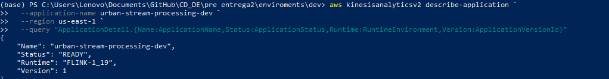

---

# 14. Iniciar Managed Flink

```powershell
aws kinesisanalyticsv2 start-application `
  --application-name urban-stream-processing-dev `
  --region us-east-1
```

Verificar nuevamente con `describe-application`.

La aplicación pasó de:

```text
STARTING
```

a:

```text
RUNNING
```

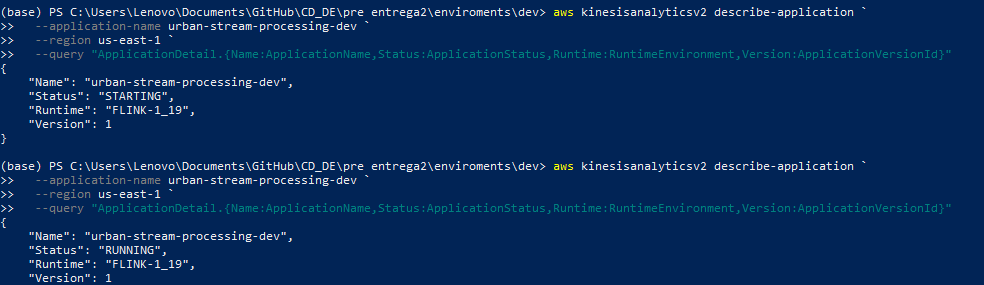

---

# 15. Ejecutar el productor

Desde:

```powershell
cd "C:\Users\Lenovo\Documents\GitHub\CD_DE\pre entrega4\scripts"
```

ejecutar:

```powershell
python kinesis_sensor_producer.py
```

El productor simula cinco sensores, utiliza `sensor_id` como `PartitionKey` y genera aproximadamente un evento cada 0,5 segundos.

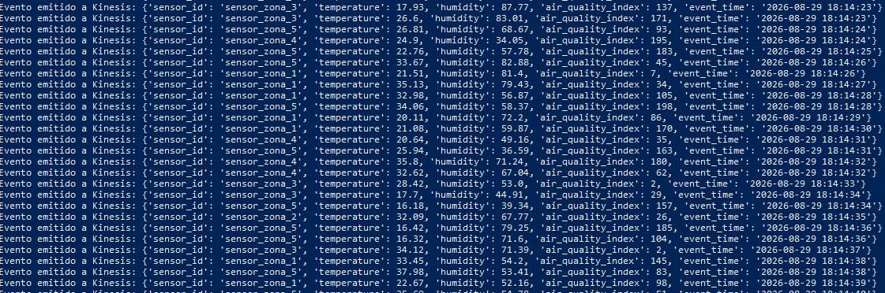

Se mantuvo activo durante varios minutos para generar múltiples ventanas y checkpoints.

---

# 16. Verificación del procesamiento Flink

Se accedió al Apache Flink Dashboard mediante una URL temporal autorizada.

El Job Graph mostró el job `collect` en estado `RUNNING` y la topología:

```text
Source: urban_sensors
        ↓
WatermarkAssigner
        ↓
Calc
        ↓
LocalWindowAggregate
        ↓
HASH
        ↓
GlobalWindowAggregate
        ↓
Calc
        ↓
ConstraintEnforcer
        ↓
Collect table sink
```

Durante la prueba se observaron:

```text
849 Records Received
```

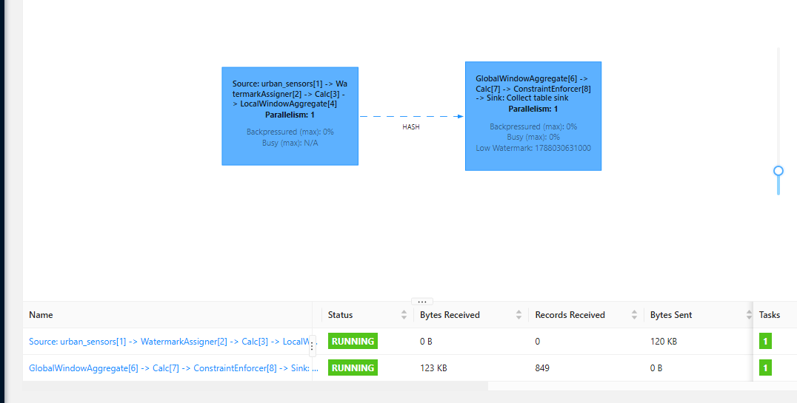

Esta evidencia verifica consumo desde Kinesis, Event Time, watermarks, procesamiento por ventanas, agregación stateful y recepción efectiva de registros.

---

# 17. Checkpoints en CloudWatch

Consulta utilizada en CloudWatch Logs Insights:

```text
fields @timestamp
| filter @message like /Completed checkpoint/
| parse @message '"message":"*"' as checkpoint_message
| display @timestamp, checkpoint_message
| sort @timestamp desc
| limit 20
```

Se observaron checkpoints consecutivos completados:

```text
Completed checkpoint 53 ...
Completed checkpoint 54 ...
Completed checkpoint 55 ...
```


---

# 18. Verificar Firehose → S3

```powershell
aws s3 ls s3://coderhouse-urban-streaming-raw-gusper-dev/ingesta/ --recursive
```

Se generaron múltiples objetos comprimidos:

```text
ingesta/year=2026/...gz
```

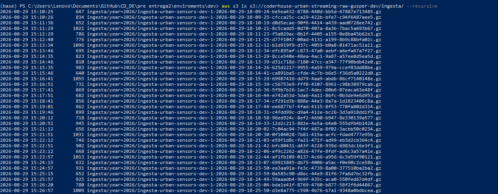

Quedaron así comprobados los dos ramales:

```text
                         ┌──► Managed Flink
                         │       ↓
Producer ─► Kinesis ─────┤   procesamiento
                         │      stateful
                         │
                         └──► Firehose ─► S3 raw
```

---

# 19. Verificación final de Terraform

```powershell
terraform state list
```

Se observaron los 12 recursos administrados por Terraform.

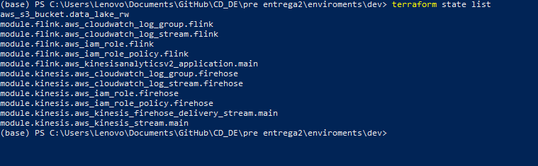

Luego:

```powershell
terraform plan
```

Resultado:

```text
No changes. Your infrastructure matches the configuration.
```

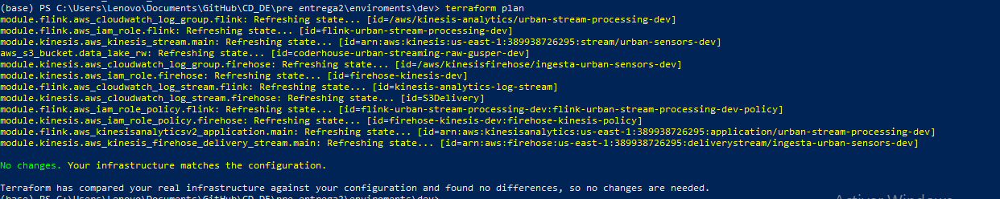

Esto confirma ausencia de drift entre la configuración declarada y la infraestructura desplegada.

---

# 20. Orden completo de ejecución

```text
1. Verificar autenticación AWS CLI
          ↓
2. Construir pyflink-dependencies.jar con Maven
          ↓
3. Crear urban_flink.zip
          ↓
4. terraform init
          ↓
5. terraform fmt -recursive
          ↓
6. terraform validate
          ↓
7. terraform plan
          ↓
8. terraform apply -target S3 + Kinesis
          ↓
9. Verificar Kinesis / Firehose / S3
          ↓
10. Cargar manualmente urban_flink.zip en S3
          ↓
11. Verificar ZIP mediante AWS CLI
          ↓
12. terraform plan
          ↓
13. terraform apply
          ↓
14. Verificar Flink en READY
          ↓
15. start-application
          ↓
16. Verificar Flink en RUNNING
          ↓
17. Ejecutar kinesis_sensor_producer.py
          ↓
18. Verificar Job Graph
          ↓
19. Verificar checkpoints en CloudWatch
          ↓
20. Verificar Firehose → S3
          ↓
21. terraform state list
          ↓
22. terraform plan → No changes
          ↓
23. Detener productor
          ↓
24. terraform destroy
```

---

# 21. Evidencias de la entrega

| Evidencia | Qué demuestra | Archivo |
|---|---|---|
| Terraform validate | Configuración válida | `imagenes/01-terraform-validate.png` |
| Apply base | Infraestructura base | `imagenes/02-terraform-apply-base.png` |
| Kinesis | Stream activo / 2 shards | `imagenes/03-kinesis-active.png` |
| Firehose | Delivery Stream activo | `imagenes/04-firehose-active.png` |
| Artefacto S3 | ZIP PyFlink disponible | `imagenes/05-s3-flink-artifact.png` |
| Apply Flink | Creación de Managed Flink | `imagenes/06-terraform-apply-flink.png` |
| Flink READY | Aplicación creada | `imagenes/07-flink-ready.png` |
| Flink RUNNING | Aplicación ejecutándose | `imagenes/08-flink-running.png` |
| Producer | Eventos enviados | `imagenes/09-producer-kinesis.png` |
| CloudWatch | Métricas | `imagenes/10-flink-cloudwatch-metrics.png` |
| Checkpoints | Procesamiento stateful | `imagenes/11-flink-checkpoints-cloudwatch.png` |
| Job Graph | Watermarks, ventanas y registros | `imagenes/12-flink-job-graph.png` |
| S3 raw | Persistencia de Firehose | `imagenes/13-firehose-s3-raw.png` |
| Terraform state | Recursos administrados | `imagenes/14-terraform-state.png` |
| Terraform plan | Ausencia de drift | `imagenes/15-terraform-no-changes.png` |
| Terraform destroy | Limpieza | `imagenes/16-terraform-destroy.png` |

---

# 22. Seguridad

Antes del commit verificar:

- No incluir `AWS_ACCESS_KEY_ID`.
- No incluir `AWS_SECRET_ACCESS_KEY`.
- No incluir tokens ni credenciales.
- No incluir URLs presignadas del Flink Dashboard.
- No incluir `terraform.tfstate`.
- No incluir `terraform.tfstate.backup`.
- No incluir `.terraform/`.
- No incluir `.tfvars` con secretos.
- Revisar los TXT antes de publicarlos.

Las credenciales AWS se mantienen fuera del código.

---

# 23. Checklist de validación

## Terraform / AWS

- [x] AWS CLI autenticado.
- [x] `terraform init`.
- [x] `terraform fmt -recursive`.
- [x] `terraform validate`.
- [x] `terraform plan`.
- [x] S3 creado.
- [x] Kinesis creado.
- [x] Firehose creado.
- [x] Managed Flink creado.
- [x] IAM configurado.
- [x] CloudWatch configurado.

## PyFlink

- [x] JAR construido con Maven.
- [x] ZIP generado.
- [x] ZIP cargado manualmente a S3.
- [x] Runtime `FLINK-1_19`.
- [x] Event Time.
- [x] Watermark de 5 segundos.
- [x] Tumbling Window de 1 minuto.
- [x] Agrupación por `sensor_id`.
- [x] `AVG temperature`.
- [x] `AVG air_quality_index`.
- [x] `COUNT`.
- [x] Checkpointing cada 60 segundos.
- [x] Job `RUNNING`.
- [x] Registros procesados observados en Job Graph.

## Persistencia

- [x] Firehose conectado a Kinesis.
- [x] Archivos `.gz` generados en S3.
- [x] Prefijo `ingesta/year=2026/` verificado.

## Evidencias

- [x] Kinesis activo.
- [x] Firehose activo.
- [x] Flink READY.
- [x] Flink RUNNING.
- [x] Productor ejecutándose.
- [x] Métricas CloudWatch.
- [x] Checkpoints completados.
- [x] Job Graph.
- [x] Registros recibidos.
- [x] Persistencia S3.
- [x] Terraform sin cambios.
- [x] Destroy completo.

---

# 24. Limpieza del entorno

Detener primero el productor:

```text
Ctrl+C
```

Desde:

```text
C:\Users\Lenovo\Documents\GitHub\CD_DE\pre entrega2\enviroments\dev
```

ejecutar:

```powershell
terraform destroy
```

Terraform presentó:

```text
Plan: 0 to add, 0 to change, 12 to destroy.
```

y finalizó con:

```text
Destroy complete! Resources: 12 destroyed.
```

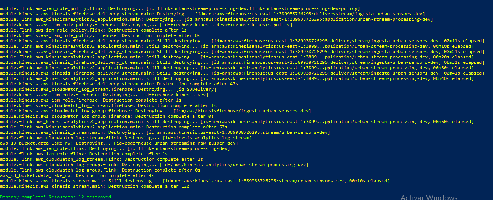

El bucket se creó con:

```hcl
force_destroy = true
```

por lo que Terraform eliminó también:

```text
flink/urban_flink.zip
ingesta/year=2026/*.gz
```

El artefacto local:

```text
pre entrega4/flink/urban_flink.zip
```

permanece disponible.

---

# 25. Resultado obtenido

La prueba validó:

```text
Python Producer
      ↓
Amazon Kinesis
   ┌──┴─────────────────┐
   ↓                    ↓
Firehose          Managed Apache Flink
   ↓                    ↓
S3 raw              PyFlink
(.gz)                   ↓
                    Event Time
                        ↓
                   Watermark 5 s
                        ↓
                 Window 1 minuto
                        ↓
                  sensor_id
                 ┌──────┼──────┐
                 ↓      ↓      ↓
               AVG T  AVG AQI COUNT
                        ↓
                 Stateful Processing
                        ↓
               Checkpoints 60 s
                        ↓
                   CloudWatch
```

Resultados observados:

```text
Managed Flink: RUNNING
Records Received: 849
Checkpoints: COMPLETED
Firehose → S3: OK
Terraform final plan: No changes
Terraform destroy: 12 resources destroyed
```

---

# 26. Publicación en GitHub

Antes del commit revisar los cambios y confirmar que no se versionen archivos de estado, carpetas locales de Terraform, credenciales ni URLs presignadas.

En GitHub Desktop:

1. Revisar **Changes**.
2. Confirmar que no existan secretos ni archivos de estado.
3. Crear un commit descriptivo, por ejemplo:

```text
Complete Pre-entrega 4 with Managed Flink stateful processing
```

4. Seleccionar **Push origin**.
5. Crear el Pull Request hacia `main`.
6. Revisar los cambios del PR antes del merge.

---

# Conclusión

La Pre-entrega 4 incorpora Amazon Managed Service for Apache Flink como motor de procesamiento stateful sobre el flujo de eventos de Kinesis.

La solución integra:

```text
Python
Kinesis
Firehose
S3
PyFlink
Event Time
Watermarks
Windowing
State
Checkpointing
CloudWatch
Terraform
```

Las evidencias obtenidas muestran la creación reproducible de la infraestructura, el procesamiento efectivo de eventos, la persistencia raw y la posterior eliminación de los recursos temporales para evitar costos innecesarios.
