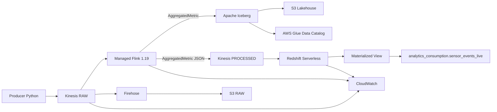

# Proyecto Final — Sistema de Streaming End-to-End en AWS

**Alumno:** Gustavo Pereyra  
**Proyecto:** CD_DE — Data Engineering  
**Región AWS:** `us-east-1`  
**Estado:** pipeline desplegado, validado end-to-end y destruido al finalizar para evitar costos.

---

## 1. Resumen ejecutivo

Este proyecto implementa una plataforma de procesamiento de eventos en tiempo real sobre AWS, administrada mediante **Infrastructure as Code (IaC)** con Terraform.

El flujo parte de eventos sintéticos de sensores urbanos enviados a **Amazon Kinesis Data Streams**. Los eventos son procesados por **Amazon Managed Service for Apache Flink** utilizando **Event Time**, **Watermarks** y ventanas temporales. El resultado agregado se persiste en dos destinos con la misma semántica:

- **Lakehouse histórico:** Apache Iceberg sobre Amazon S3, con catálogo en AWS Glue.
- **Warehouse de baja latencia:** Amazon Redshift Serverless mediante Streaming Ingestion desde un stream procesado de Kinesis.

La solución fue validada de punta a punta. La corrida final confirmó que Iceberg y Redshift contenían exactamente los mismos `aggregation_id` procesados: **65 coincidentes, 0 sólo en Redshift y 0 sólo en Iceberg**.

También se validaron checkpoints, recuperación de Flink, Iterator Age, backpressure, freshness, seguridad IAM, conectividad privada y destrucción completa del entorno.

> La consigna formal del proyecto solicita además un **Documento de Arquitectura y Auditoría Técnica (DAAT) en PDF**. Este README documenta el repositorio y sirve como base técnica reproducible para dicho documento.

---

## 2. Objetivo

Construir y auditar una plataforma de streaming capaz de demostrar el flujo completo:

```text
Producer Python
    ↓
Kinesis RAW
    ↓
Apache Flink
    ├────────────→ Apache Iceberg / S3 / Glue
    │
    └────────────→ Kinesis PROCESSED
                         ↓
                  Redshift Serverless
                         ↓
                  Materialized View
                         ↓
                    Vista analítica
```

La solución cubre:

- Networking e IAM.
- Infraestructura completa con Terraform.
- Backend remoto de Terraform.
- Kinesis RAW y PROCESSED.
- Flink con Event Time y Watermarks.
- Checkpointing y recuperación.
- Apache Iceberg + Glue + S3.
- Redshift Streaming Ingestion.
- Consistencia Lakehouse / Warehouse.
- Idempotencia y control de duplicados.
- Observabilidad.
- Backpressure.
- Control de costos y `terraform destroy`.

---

## 3. Correspondencia con la consigna

| Criterio | Implementación | Evidencia |
|---|---|---|
| Infraestructura integral | Terraform modular para red, IAM, Kinesis, Flink, Glue, S3 y Redshift | `04_capstone_full_plan.txt`, `05_capstone_apply.png` |
| Consistencia de datos | Comparación de `aggregation_id` entre Iceberg y Redshift | `18_iceberg_redshift_consistency.png` |
| Event Time / Watermarks | Flink con timestamps de evento y Watermarks | Código `LakehouseStreamingJob.java` |
| Observabilidad | Iterator Age, checkpoints, backpressure y freshness | Evidencias `19` a `22` |
| Seguridad | IAM acotado a recursos concretos | Terraform final |
| Backend remoto | S3 versionado/cifrado con lockfile | Evidencias `01` a `03` |
| Recuperación | Stop/start controlado de Flink | `23_flink_restart_recovery.png` |
| Idempotencia | `aggregation_id` determinístico + validación de duplicados | `17_redshift_duplicate_check.png` |
| Control de costos | Destrucción del entorno y del backend | `24_terraform_destroy.png`, `25_bootstrap_destroy.png` |

---

## 4. Arquitectura



### Decisión arquitectónica

Se utilizan dos streams:

```text
urban-sensors-raw-dev
urban-sensors-processed-dev
```

El primero recibe eventos originales. El segundo recibe exclusivamente la salida agregada de Flink.

Esta separación permite que Redshift no replique lógica de negocio distinta a la del Lakehouse. Ambos destinos parten de la misma entidad lógica procesada por Flink.

---

## 5. Flujo end-to-end

1. `producer/Kinesis_sensor_producer.py` genera eventos sintéticos.
2. Los eventos ingresan a Kinesis RAW.
3. Flink consume el stream.
4. El JSON se convierte a `SensorEvent`.
5. Se toma `event_time` como Event Time.
6. Se aplican Watermarks.
7. Los eventos se agrupan por `sensor_id`.
8. Se utiliza una ventana Tumbling de 1 minuto.
9. Flink genera `AggregatedMetric`.
10. La misma métrica se escribe en Iceberg y Kinesis PROCESSED.
11. Redshift consume Kinesis PROCESSED mediante Streaming Ingestion.
12. Una Materialized View mantiene la ingesta.
13. Una vista tipada expone las columnas analíticas.
14. Redshift consulta también Iceberg mediante Glue Data Catalog.
15. Se compara `aggregation_id` entre ambos destinos.

---

## 6. Contrato de entrada

Ejemplo de evento RAW:

```json
{
  "sensor_id": "sensor-001",
  "temperature": 24.8,
  "humidity": 61.3,
  "air_quality_index": 42,
  "event_time": "2026-09-11T23:40:10Z"
}
```

| Campo | Uso |
|---|---|
| `sensor_id` | clave lógica |
| `temperature` | métrica |
| `humidity` | métrica original |
| `air_quality_index` | métrica |
| `event_time` | timestamp de Event Time |

---

## 7. Entidad agregada

La salida común de Flink contiene:

| Campo | Descripción |
|---|---|
| `aggregation_id` | identificador determinístico |
| `sensor_id` | sensor |
| `window_start` | comienzo de ventana |
| `window_end` | fin de ventana |
| `avg_temperature` | temperatura promedio |
| `avg_air_quality_index` | AQI promedio |
| `event_count` | cantidad de eventos |
| `event_date` | fecha UTC |

El identificador se construye de forma determinística a partir de:

```text
sensor_id | window_start | window_end
```

Esto permite detectar re-procesamientos y duplicados.

---

## 8. Event Time, Watermarks y ventanas

La aplicación utiliza **Event Time**.

```text
Bounded out-of-orderness : 5 segundos
Idleness                 : 30 segundos
Window                    : 1 minuto
Window type               : TumblingEventTimeWindow
Key                       : sensor_id
```

La agregación se basa en el momento real del evento y no en el momento en que Flink lo recibe.

El Watermark tolera eventos retrasados dentro del umbral configurado. El manejo de idleness evita que una partición temporalmente inactiva bloquee el avance global del watermark.

---

## 9. Procesamiento stateful y checkpoints

La agregación mantiene por ventana:

```text
temperatureSum
airQualitySum
count
```

y calcula:

```text
avg_temperature       = temperatureSum / count
avg_air_quality_index = airQualitySum / count
```

Parámetros principales:

| Parámetro | Valor |
|---|---:|
| Runtime | Flink 1.19 |
| Checkpointing | habilitado |
| Checkpoint interval | 60.000 ms |
| Minimum pause | 5.000 ms |
| Parallelism | 1 |
| Parallelism per KPU | 1 |

Validación final:

```text
Completed checkpoints = 116
Failed checkpoints    = 0
```

---

## 10. Recuperación ante fallos

Se realizó una prueba controlada:

```text
RUNNING
   ↓ stop-application
READY
   ↓ start-application
STARTING
   ↓
RUNNING
```

Esto demuestra la capacidad de reinicio controlado de la aplicación Flink.

Checkpointing protege estado y posición de procesamiento, pero no debe confundirse con una garantía automática de exactly-once para todos los sistemas externos.

---

## 11. Exactly-once, at-least-once e idempotencia

El proyecto **no afirma exactly-once end-to-end**.

La rama hacia Kinesis PROCESSED puede operar con semántica **at-least-once**, por lo que un evento agregado podría ser reenviado durante ciertos escenarios de recuperación.

Para controlar ese riesgo se utiliza `aggregation_id` determinístico.

Resultado de la validación:

```text
total_rows               = 65
distinct_aggregation_ids = 65
duplicate_rows           = 0
```

No se observaron duplicados en la corrida auditada.

---

## 12. Lakehouse — Iceberg + Glue + S3

Catálogo:

```text
Database: lakehouse_db
Tabla:    sensor_events
```

Esquema validado:

```text
sensor_id
window_start
window_end
avg_temperature
avg_air_quality_index
event_count
event_date
aggregation_id
```

Los datos se almacenan como Parquet y los metadatos Iceberg se persisten en S3.

Estructura conceptual:

```text
lakehouse/
└── lakehouse_db.db/
    └── sensor_events/
        ├── data/
        │   └── event_date=YYYY-MM-DD/
        │       └── *.parquet
        └── metadata/
            ├── *.metadata.json
            └── *.avro
```

Glue actúa como catálogo lógico para permitir que otros motores descubran la tabla.

---

## 13. Redshift Serverless

Configuración utilizada:

```text
Database       = dev
Base capacity  = 8 RPU
Public access  = false
```

El flujo analítico es:

```text
Kinesis PROCESSED
       ↓
Kinesis External Schema
       ↓
sensor_events_processed_stream
       ↓
analytics_consumption.sensor_events_live
```

La Materialized View conserva el `payload` JSON y metadatos del stream. La vista analítica convierte dicho payload en columnas tipadas.

---

## 14. Consistencia Redshift / Iceberg

Consulta principal de validación:

```sql
WITH redshift_data AS (
    SELECT DISTINCT aggregation_id
    FROM analytics_consumption.sensor_events_live
),
iceberg_data AS (
    SELECT DISTINCT aggregation_id
    FROM lakehouse_iceberg.sensor_events
)
SELECT
    SUM(CASE WHEN r.aggregation_id IS NOT NULL
              AND i.aggregation_id IS NOT NULL
             THEN 1 ELSE 0 END) AS matched_ids,
    SUM(CASE WHEN r.aggregation_id IS NOT NULL
              AND i.aggregation_id IS NULL
             THEN 1 ELSE 0 END) AS only_redshift,
    SUM(CASE WHEN r.aggregation_id IS NULL
              AND i.aggregation_id IS NOT NULL
             THEN 1 ELSE 0 END) AS only_iceberg
FROM redshift_data r
FULL OUTER JOIN iceberg_data i
    ON r.aggregation_id = i.aggregation_id;
```

Resultado:

```text
matched_ids   = 65
only_redshift = 0
only_iceberg  = 0
```

Esta es la principal evidencia de consistencia semántica del proyecto.

---

## 15. Networking

La infraestructura utiliza una VPC propia:

```text
CIDR = 10.20.0.0/16
```

Se crean tres subnets privadas.

Endpoints utilizados:

| Servicio | Tipo |
|---|---|
| Kinesis | Interface |
| Glue | Interface |
| S3 | Gateway |

Durante la validación, Redshift inicialmente no podía consultar Iceberg y devolvía un timeout de acceso a AWS. La incorporación de los endpoints privados de Glue y S3 resolvió el problema.

Después del cambio:

```sql
SELECT COUNT(*)
FROM lakehouse_iceberg.sensor_events;
```

respondió correctamente con:

```text
65
```

---

## 16. Seguridad

La solución aplica **least privilege** en los roles principales.

Flink dispone sólo de permisos necesarios para:

```text
Kinesis RAW       → lectura
Kinesis PROCESSED → escritura
S3 artifact       → lectura
S3 Lakehouse      → lectura/escritura
Glue              → catálogo/database/table
CloudWatch        → escritura en log stream específico
```

Las políticas finales restringen los recursos a ARN concretos en lugar de otorgar permisos globales de datos.

Redshift utiliza permisos limitados al stream procesado, Glue y el bucket del Lakehouse.

El workgroup se desplegó sin acceso público.

En los roles críticos de Flink y Redshift no se utilizaron permisos de datos con `Resource = "*"`. Los permisos fueron acotados a los streams, buckets, catálogo Glue y recursos de logging requeridos por la aplicación.

---

## 17. Observabilidad

### 17.1 Kinesis Iterator Age

Se verificó:

```text
IteratorAgeMilliseconds
```

con dimensiones `StreamName` y `ShardId`.

Resultado observado:

```text
IteratorAgeMs = 0.0
```

### 17.2 Flink checkpoints

```text
Completed = 116
Failed    = 0
```

### 17.3 Flink backpressure

Métrica:

```text
backPressuredTimeMsPerSecond
```

Resultado:

```text
0.0
```

### 17.4 Freshness Redshift

Consulta:

```sql
SELECT
    MAX(approximate_arrival_timestamp) AS last_event,
    DATEDIFF(
        minute,
        MAX(approximate_arrival_timestamp),
        GETDATE()
    ) AS freshness_minutes
FROM analytics_consumption.sensor_events_live;
```

La captura final devolvió `107` minutos porque el producer ya había sido detenido deliberadamente. La consulta funciona como control de antigüedad del último dato disponible.

---

## 18. Análisis de backpressure

### Flink → Iceberg

```text
Iceberg/S3 lento
       ↓
sink Flink demora
       ↓
backpressure aumenta
       ↓
Flink consume RAW más lentamente
       ↓
Iterator Age aumenta
```

### Flink → Kinesis PROCESSED → Redshift

Kinesis desacopla a Redshift de Flink.

Si Redshift consume más lentamente, primero aumenta el lag del consumidor. El backpressure se propagaría hacia Flink si Kinesis PROCESSED llegara a saturarse y `PutRecord/PutRecords` comenzaran a demorar o reintentarse.

```text
Kinesis PROCESSED saturado
       ↓
sink Flink lento
       ↓
backpressure
       ↓
menor consumo RAW
       ↓
mayor Iterator Age
```

---

## 19. Saturación de un shard

Síntomas esperados:

```text
IteratorAgeMilliseconds ↑
millisBehindLatest ↑
backPressuredTimeMsPerSecond ↑
freshness_minutes ↑
throughput relativo ↓
throttling ↑
```

Variables a revisar:

- distribución de partition keys;
- capacidad de cada shard;
- records/sec y bytes/sec;
- parallelism de Flink;
- latencia de sinks;
- lag de Redshift.

Mitigaciones:

- incrementar shards;
- mejorar partition key;
- aumentar parallelism/KPU;
- revisar sinks lentos;
- evaluar modo On-Demand para un patrón de carga imprevisible.

---

## 20. Infrastructure as Code

Estructura:

```text
terraform/
├── bootstrap/
├── environments/
│   └── dev/
└── modules/
    ├── network/
    ├── lakehouse/
    ├── kinesis/
    ├── flink/
    └── redshift/
```

Responsabilidades:

| Módulo | Responsabilidad |
|---|---|
| `network` | VPC, subnets, routing y endpoints |
| `lakehouse` | buckets S3 y Glue database |
| `kinesis` | RAW, PROCESSED, Firehose y logs |
| `flink` | aplicación, IAM y CloudWatch |
| `redshift` | Serverless, IAM y networking |

---

## 21. Backend remoto Terraform

El backend se crea mediante un bootstrap separado.

Características:

```text
S3
versioning enabled
server-side encryption
public access blocked
native S3 lockfile
```

Configuración:

```hcl
backend "s3" {}
```

El archivo local `backend.hcl` contiene la configuración específica del entorno y no debe versionarse.

También se ignoran:

```text
terraform.tfvars
*.tfstate
*.tfstate.backup
.terraform/
flink-app/target/
```

---

## 22. Estructura del repositorio

```text
proyecto final/
├── terraform/
│   ├── bootstrap/
│   ├── environments/dev/
│   └── modules/
│       ├── network/
│       ├── lakehouse/
│       ├── kinesis/
│       ├── flink/
│       └── redshift/
├── flink-app/
│   ├── pom.xml
│   └── src/main/java/com/coderhouse/lakehouse/
│       └── LakehouseStreamingJob.java
├── producer/
│   └── Kinesis_sensor_producer.py
├── sql/
│   └── 01_redshift_streaming_processed.sql
├── evidencias/
├── docs/
└── README.md
```

---

## 23. Despliegue reproducible

### Requisitos

```text
AWS CLI
Terraform
Java 11+
Maven
Python 3
boto3
credenciales AWS válidas
```

### Compilar Flink

Desde `proyecto final/flink-app`:

```powershell
mvn clean package -DskipTests
```

Resultado esperado:

```text
BUILD SUCCESS
```

### Bootstrap

Desde `proyecto final/terraform/bootstrap`:

```powershell
terraform init
terraform validate
terraform plan
terraform apply
```

### Inicializar entorno dev

Desde `proyecto final/terraform/environments/dev`:

```powershell
terraform init -backend-config=backend.hcl
terraform validate
terraform plan
terraform apply
```

El plan inicial completo mostró:

```text
Plan: 37 to add, 0 to change, 0 to destroy
```

Posteriormente se incorporaron los endpoints de Glue y S3. El entorno final administrado por el Terraform principal contenía 40 recursos.

### Iniciar Flink

```powershell
aws kinesisanalyticsv2 start-application `
  --application-name urban-stream-processing-dev `
  --region us-east-1
```

### Ejecutar producer

```powershell
$env:KINESIS_STREAM_NAME = "urban-sensors-raw-dev"
$env:AWS_REGION = "us-east-1"
python .\producer\Kinesis_sensor_producer.py
```

---
> `backend.hcl` y `terraform.tfvars` son archivos locales y están excluidos mediante `.gitignore`. Deben crearse para cada entorno antes de ejecutar el despliegue.
> 
## 24. Validaciones SQL

Conteo en Redshift:

```sql
SELECT COUNT(*)
FROM sensor_events_processed_stream;
```

Resultado:

```text
65
```

Conteo Iceberg:

```sql
SELECT COUNT(*) AS iceberg_rows
FROM lakehouse_iceberg.sensor_events;
```

Resultado:

```text
65
```

Duplicados:

```sql
SELECT
    COUNT(*) AS total_rows,
    COUNT(DISTINCT aggregation_id) AS distinct_aggregation_ids,
    COUNT(*) - COUNT(DISTINCT aggregation_id) AS duplicate_rows
FROM analytics_consumption.sensor_events_live;
```

Resultado:

```text
65
65
0
```

---

## 25. Trade-offs

### Kinesis Provisioned

**Ventajas:** capacidad explícita, métricas por shard y comportamiento previsible.  
**Desventajas:** requiere dimensionamiento y puede generar throttling si la demanda supera la capacidad.

### Redshift Streaming Ingestion

**Ventajas:** baja latencia, elimina cargas `COPY` periódicas y permite Materialized Views sobre Kinesis.  
**Desventajas:** consume capacidad de Redshift y el replay depende de la retención del stream.

### Apache Iceberg

**Ventajas:** formato abierto, histórico, snapshots, Parquet y separación storage/compute.  
**Desventajas:** mayor complejidad de metadata, commits y riesgo de small files.

### Dos streams RAW / PROCESSED

**Ventajas:** separa datos originales de agregados, desacopla Redshift de Flink y facilita la validación de consistencia.  
**Desventajas:** agrega otro recurso, costo y frontera de entrega at-least-once.

---

## 26. Control de costos

El entorno se dimensionó como `dev`:

```text
2 shards por stream
24 h de retención
parallelism Flink = 1
Redshift Serverless = 8 RPU
```

Una vez obtenidas las evidencias se detuvo Flink y se ejecutó:

```text
terraform destroy
Destroy complete! Resources: 40 destroyed.
```

Luego se vació el bucket versionado del backend y se destruyó el bootstrap:

```text
Destroy complete! Resources: 1 destroyed.
```

Los recursos administrados por los Terraform del proyecto fueron destruidos al finalizar la prueba.

---

## 27. Evidencias

La carpeta `evidencias/` contiene:

```text
01_bootstrap_plan.txt
02_bootstrap_apply.png
03_remote_backend_init.png
04_capstone_full_plan.txt
05_capstone_apply.png
06_kinesis_raw_processed_active.png
07_flink_ready_jar_s3.png
08_flink_running.png
09_processed_stream_records.png
10_glue_iceberg_schema.png
11_iceberg_s3_data.png
12_redshift_serverless_available.png
13_redshift_admin_connection.png
14_redshift_external_schema_processed.png
15_redshift_processed_count.png
16_redshift_typed_live_view.png
17_redshift_duplicate_check.png
18_iceberg_redshift_consistency.png
19_flink_checkpoints.png
20_flink_failed_checkpoints.png
21_kinesis_iterator_age.png
22_redshift_freshness.png
23_flink_restart_recovery.png
24_terraform_destroy.png
25_bootstrap_destroy.png
```

Las capturas exclusivamente de troubleshooting no se consideran evidencia formal de aceptación.

---

## 28. Limitaciones y mejoras futuras

Una evolución productiva debería incorporar:

- alarmas CloudWatch;
- SLO/SLA explícitos;
- autoscaling de Flink;
- tests automáticos Terraform;
- tests de contrato de esquema;
- automatización SQL mediante Redshift Data API o CI/CD;
- pruebas de carga;
- deduplicación materializada si fuera necesaria;
- lifecycle policies S3;
- compaction Iceberg;
- dashboards operativos;
- estrategia formal de replay y disaster recovery;
- parametrización completa de watermark, ventana, checkpoint interval, parallelism, KPU y shard count.

---

## 29. Resultado final

La ejecución auditada confirmó:

```text
65 registros Iceberg
65 registros Redshift
65 aggregation_id coincidentes
0 sólo Redshift
0 sólo Iceberg
0 duplicados
116 checkpoints completados
0 checkpoints fallidos
0 ms/s de backpressure observado
0 ms de Iterator Age observado
recovery Flink exitoso
```

El pipeline demostró funcionamiento end-to-end desde la entrada de un evento en Kinesis hasta su disponibilidad tanto en Iceberg como en Redshift.

---

## 30. Repositorio

```text
https://github.com/gusper01/CD_DE
```

Branch del capstone:

```text
feature/capstone-realtime
```

Antes de la entrega debe verificarse que el repositorio sea accesible por el evaluador.

---

## 31. Entregable DAAT

La consigna solicita como entrega formal un PDF con nombre equivalente a:

```text
Gustavo_Pereyra_Capstone_RealTime.pdf
```

El DAAT debe incorporar, además del contenido técnico de este README:

- diagrama de arquitectura final;
- evidencias/capturas;
- parámetros críticos;
- resultados de validación;
- análisis de fallos;
- análisis de backpressure;
- trade-offs;
- enlace al repositorio;
- conclusión de auditoría.

---

## 32. Conclusión

El proyecto consolida en una única solución los principales componentes de una plataforma moderna de streaming: IaC, ingesta en tiempo real, procesamiento stateful, Event Time, Watermarks, checkpointing, Lakehouse, Streaming Warehouse, observabilidad, seguridad, idempotencia, recuperación y gestión de costos.

La infraestructura fue desplegada mediante Terraform, se procesaron eventos sintéticos de prueba, se verificó la persistencia en Iceberg y Redshift, se demostró igualdad entre ambas ramas, se observaron métricas operativas, se probó la recuperación de Flink y finalmente se destruyeron los recursos utilizados.
